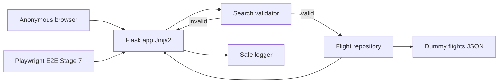

# Architecture

## Overview

KAN-1 (Search flight) is delivered as a small **Flask** Python web application. Anonymous users open a public search page, submit departure city, arrival city, travel date, and passenger count, and see either a dummy-flight result list, an empty-state message, or field-level validation errors. There is no booking, payment, authentication, or live airline integration.

The runtime is a single process: Flask serves Jinja2 HTML, a validator checks the form, and an in-memory repository filters a static JSON dummy catalog. Stage 7 Playwright E2E will drive this HTML UI (happy path, validation, no-results) against a locally running Flask server.

## Goals & Constraints (from requirements)

| Source | Constraint |
|--------|------------|
| FR-1–3 | Public, unauthenticated search page with required form fields and a **Search Flights** control |
| FR-4–5 | Query **dummy/mock** flights only; case-insensitive exact match on departure city, arrival city, and travel date |
| FR-6–8 | Reject same cities, past dates, missing/invalid fields, and passenger counts outside 1–9 **before** searching |
| FR-9–11 | Result rows show airline, flight number, cities, times, duration, stops, price; passengers are display-only; zero matches → “No flights found” |
| NFR | Python web app; Playwright E2E in Verify; no secrets in source/docs; graceful errors; search completes within 2s locally |
| Out of scope | Booking, real APIs, login, round-trip/multi-city, passenger-driven inventory, admin catalog UI |

Dummy-data storage (deferred from Stage 1): a versioned JSON file loaded at process start (see Components and Trade-offs).

## Component Diagram (mermaid)



Search sequence:

```mermaid
sequenceDiagram
  actor User
  participant Page as Search page GET /
  participant Post as POST /search
  participant Val as Validator
  participant Repo as Flight repository
  participant JSON as flights.json

  User->>Page: Open search form (no login, CSRF + server-today)
  User->>Post: Submit cities, date, passengers, CSRF
  Post->>Val: Trim/normalize; required; 1-9 pax; not past; cities differ
  alt Invalid
    Val-->>Post: Field errors
    Post-->>User: Re-render form + messages (no list)
  else Valid
    Post->>Repo: Filter by city+date (case-insensitive exact)
    Repo->>JSON: In-memory catalog
    alt Matches
      Repo-->>Post: Flight list
      Post-->>User: Results with required fields + pax context
    else Zero matches
      Repo-->>Post: Empty list
      Post-->>User: No flights found
    end
  end
```

## Components & Responsibilities

| Component | Responsibility |
|-----------|----------------|
| Flask application (`app` factory) | HTTP server, URL routing, template rendering, CSRF-safe form POST, 404/500 handlers that never leak stack traces or secrets |
| Search page (Jinja2) | Labels, HTML date input (`YYYY-MM-DD`), passenger input, **Search Flights** button, error region, empty-state copy, result cards/table, passenger count as display context, `server-today` for E2E |
| Search validator | Required fields after **trim** (whitespace-only = missing); passengers integer 1–9 (reject non-integers); shared city normalize (`strip` + `casefold`) for same-city reject; travel date not before server “today”; ISO date parse |
| Flight repository | Load dummy JSON at startup (**fail fast** if missing/malformed); same city normalize as validator + exact `travel_date`; return list ordered by `departure_time` ASC then `flight_number` ASC |
| Dummy catalog (`data/flights.json`) | Static mock flights with **seeded fixtures** (below) covering happy path, zero matches, mixed-case cities, and all required display fields |
| Safe logger | Unexpected exceptions only (MVP); no tokens, no `api-conf.properties` contents |
| Playwright E2E (Stage 7, not implemented now) | Browser tests against the live Flask UI for AC flows |

**Requirement mapping:** FR-1–3 → Flask + search page; FR-4–5, FR-9–10 → repository + catalog + result/empty templates; FR-6–8 → validator; FR-11 → template context only; NFR verification → Playwright against GET `/` and POST `/search`; NFR security → gitignore + no secrets in catalog.

## Data Flow

1. **GET `/`:** Render empty search form. No catalog query.
2. **POST `/search`:** Read form fields (`departure_city`, `arrival_city`, `travel_date`, `passengers`). Include CSRF token from the GET `/` form (Flask-WTF).
3. **Normalize:** Trim string fields. Shared `normalize_city(s) = s.strip().casefold()`.
4. **Validate** in order: presence (empty or whitespace-only fails) → passenger integer in 1–9 (reject `2.5`, letters, empty) → parse date ISO `YYYY-MM-DD` → not past (`date < today` rejected; **today is allowed**) → `normalize_city(departure) != normalize_city(arrival)`.
5. **On validation failure:** Re-render the form with submitted values (where safe) and user-visible messages. Do not call the repository. Do not show a result list or empty-state.
6. **On validation success:** Repository filters in-memory flights where `normalize_city(catalog.departure_city) == normalize_city(input)`, same for arrival, and `travel_date == YYYY-MM-DD`. Passenger count is **not** used as a filter or price multiplier.
7. **Render:** If `len(results) > 0`, list each flight’s required fields in sort order and show passenger count as context. If zero, show “No flights found” (or equivalent). Target response well under 2 seconds (in-memory filter).

Catalog record shape (logical; implementation in Stage 5):

- `airline`, `flight_number`, `departure_city`, `arrival_city`, `travel_date`, `departure_time`, `arrival_time`, `duration`, `stops`, `price` (display string or number formatted in the template)

## Technology Choices (with rationale)

| Choice | Decision | Rationale |
|--------|----------|-----------|
| Language | Python 3 | Required by NFR and SDLC defaults |
| Web framework | **Flask** | Smallest fit for one public HTML form + results. Jinja2 is built-in, Playwright can target real DOM. No REST-only client is required. |
| Not FastAPI | — | FastAPI shines for JSON APIs. This story is server-rendered HTML; FastAPI would still need Jinja2 (or a SPA) with more ceremony and no MVP benefit. |
| Not Django | — | Django’s ORM, admin, and auth are unused: no login, no admin catalog, no booking models. Extra surface area without matching requirements. |
| Templates | Jinja2 (autoescape on) | Simple SSR; XSS-safe by default for dummy text fields |
| Dummy storage | JSON file → memory at startup | Human-readable fixtures for Playwright; no database or ORM for static mock data |
| Persistence | None | Search is stateless; Flask session cookie exists only to carry CSRF (Flask-WTF) |
| CSRF | **Flask-WTF required** on POST `/search` | Anonymous MVP still POSTs; CSRF is cheap and keeps Playwright on a realistic form. Token is read from GET `/` — never hardcoded |
| Process | Flask `debug=False` by default | Werkzeug interactive debugger must not run in E2E or committed run scripts (stack traces / PIN leakage) |
| Tests (later) | pytest unit/integration + Playwright MCP E2E | Matches Stage 7 skill; unit-test validator + repository without a browser |
| HTTP | Flask development server locally; production WSGI deferred | MVP is local/dev search within 2s |

**Flask vs FastAPI vs Django (summary):** Choose **Flask** because KAN-1 is a single anonymous HTML search page against static JSON. Django is heavier than the out-of-scope admin/auth needs. FastAPI is API-centric and would add template wiring without improving the Playwright-facing UI.

## Interfaces / Contracts

### HTTP

| Method | Path | Auth | Behavior |
|--------|------|------|----------|
| GET | `/` | None | Search form; no results list; includes CSRF token field |
| POST | `/search` | None | `application/x-www-form-urlencoded`: `departure_city`, `arrival_city`, `travel_date` (`YYYY-MM-DD`), `passengers`, plus CSRF field. 200 HTML: errors, results, or empty state (not a 4xx for business validation). Missing/invalid CSRF → 400 generic error (no stack trace) |
| GET | `/search` | None | **302 redirect to `/`** (empty form). Do not treat GET as a search |
| GET | `/health` | None | Liveness **after successful catalog load** (`{"status":"ok"}`). Process does not bind HTTP if JSON is missing/malformed |

Stable **element contracts** for Playwright (Stage 7 must use these `data-testid` values):

| `data-testid` | Element |
|---------------|---------|
| `search-form` | Form |
| `departure-city` | Departure input |
| `arrival-city` | Arrival input |
| `travel-date` | Date input |
| `passengers` | Passenger input |
| `search-submit` | Search Flights control |
| `validation-errors` | Validation message region (hidden/empty when valid) |
| `results-list` | Results container |
| `flight-card` | Each result row/card |
| `no-flights` | Empty-state message when valid search has zero matches |
| `passenger-context` | Display of submitted passenger count on **valid** search (matches or zero matches) |
| `server-today` | Read-only ISO `YYYY-MM-DD` of Flask process local “today” (for E2E date math; not a search field) |

**Do not reuse form test ids on result cards.** Inner result fields (unique, namespaced):

| `data-testid` | Element |
|---------------|---------|
| `result-airline` | Airline |
| `result-flight-number` | Flight number |
| `result-departure-city` | Departure city on the card |
| `result-arrival-city` | Arrival city on the card |
| `result-departure-time` | Departure time |
| `result-arrival-time` | Arrival time |
| `result-duration` | Duration |
| `result-stops` | Number of stops |
| `result-price` | Price (display) |

**DOM state matrix (Playwright must assert this, not “absent or empty” ambiguity):**

| Outcome | `validation-errors` | `results-list` / `flight-card` | `no-flights` | `passenger-context` |
|---------|---------------------|--------------------------------|--------------|---------------------|
| GET `/` (initial) | Hidden/empty | Not in DOM | Not in DOM | Not in DOM |
| Validation failure | Visible with message(s) | Not in DOM | Not in DOM | Not in DOM |
| Valid, ≥1 match | Hidden/empty | Present; one `flight-card` per row | Not in DOM | Present |
| Valid, zero matches | Hidden/empty | Not in DOM | Visible | Present |

### Repository contract

`search(departure_city: str, arrival_city: str, travel_date: date) -> list[Flight]` — applies `normalize_city` to both catalog and inputs; exact date; never mutates catalog; sort `departure_time` ASC, `flight_number` ASC.

### Seeded catalog fixtures (Stage 5 must include; Stage 7 must use)

Far-future `travel_date` values so Playwright never collides with “past date” as calendar time advances. City spellings in JSON keep mixed case to prove FR-5.

| Fixture purpose | Departure | Arrival | `travel_date` | Notes |
|-----------------|-----------|---------|---------------|-------|
| Happy path (≥1 row) | `Delhi` | `Mumbai` | `2099-06-15` | E2E types `delhi` / `Mumbai`; at least one full field set |
| Mixed-case extra row | `delhi` (catalog may use `Delhi`) | `Mumbai` | `2099-06-15` | Optional second flight same route/date for list coverage |
| Zero matches | `Delhi` | `Kolkata` | `2099-12-31` | Pair must **not** exist in catalog; valid search → `no-flights` |
| Past-date E2E | n/a | n/a | **yesterday** relative to server local date | Not stored; tests compute `today-1` |
| Same-city E2E | `Delhi` | `delhi` | any valid future | Validator only; no list |

### Playwright E2E plan (Stage 7)

Scripts (paths reserved; **not authored in Stage 2**): `tests/e2e/test_search_happy.py`, `tests/e2e/test_search_validation.py`, `tests/e2e/test_search_no_results.py`.

Coverage: open `/` without login; GET `/` then POST `/search` **including CSRF token**; submit matching dummy row (`delhi` vs `Delhi` on `2099-06-15`); same city error and no list / no `no-flights`; past date = yesterday in **server local** calendar; missing/out-of-range passengers; `Delhi`+`Kolkata`+`2099-12-31` → `no-flights`. Dates for happy/zero-match paths are the seeded far-future values above, not “today”.

## Security & Secret Handling

- No API keys, airline credentials, or user accounts. Dummy JSON contains only public mock schedule/price display data.
- **Never commit** `api-conf.properties`, `.env`, or GitHub/Jira tokens. Keep `.gitignore` as in Stage 1.
- Jinja2 autoescape on; do not mark user cities as `|safe`.
- Do not log request bodies that could later include secrets; do not print `api-conf.properties`.
- Flask `SECRET_KEY` for CSRF: environment variable only, never hardcoded; document a local-only placeholder in `.env.example`. Flask-WTF is **required** for POST `/search`.
- Run with `debug=False`; do not enable the Werkzeug interactive debugger in committed start scripts.
- Anonymous access is intentional; no session identity.
- Unexpected 500s: generic user message + safe server log (exception type/message without secrets).

## Failure Modes & Resilience

| Failure | User-visible behavior | System behavior |
|---------|----------------------|-----------------|
| Missing/invalid form fields | Field/validation messages; no result list | No repository call |
| Same city / past date / passengers out of 1–9 | Clear validation error; no result list | No repository call |
| Valid search, zero rows | “No flights found” | 200 HTML; `no-flights` visible; `results-list` not in DOM |
| Dummy JSON missing or malformed at startup | Process does not accept traffic (fail fast); Playwright `/health` never becomes ok | Log path/reason without file contents dump of secrets; do not invent flights; do not start with an empty catalog |
| Missing/invalid CSRF | Generic 400; no result list | Safe log of CSRF failure type only |
| Unexpected exception during search | Generic error page/banner | Safe log; no stack trace in HTML |
| Concurrent local users | Stateless request handling; in-memory catalog is read-only | Acceptable for MVP |

Past-date comparison uses the Flask process **local calendar date** as “today” (requirements: server/local today). GET `/` exposes that date as `data-testid="server-today"`. Playwright past-date cases **must** derive yesterday from that value (not the browser clock). Seeded search dates stay in 2099 so they remain valid.

## Open Trade-offs

| Topic | Decision now | Alternative | Notes |
|-------|--------------|-------------|-------|
| Flask vs FastAPI vs Django | **Flask** | FastAPI+Jinja or Django | Revisit only if humans require an API-first or admin UI |
| JSON file vs SQLite | JSON in memory | SQLite | JSON is enough for static mocks; SQLite adds ops without AC benefit |
| Same-page POST vs GET query string | **POST `/search`** | GET with query params | POST avoids bookmarking personal search data; Playwright can still POST the form. Shareable URLs are not a requirement |
| CSRF (Flask-WTF) | **Required** | Bare POST | `SECRET_KEY` from env; Playwright copies token from GET `/`. Bare POST is simpler but weaker; rejected in Design Review |
| Result field test ids | Namespaced `result-*` | Reuse form ids | Form and cards must not share `data-testid` values |
| Result URL | 200 on POST | 303 to GET | POST-render is simpler for MVP; refresh re-POSTs (acceptable) |
| Price type | Display as provided in JSON | Currency localization | Out of scope beyond showing the dummy price |
| Health endpoint | **Required** `GET /health` | Skip | Playwright wait-for-ready after catalog load |

No production implementation code is included in this stage. Implementation Planning (Stage 4) must not start until a human accepts the Design Review.
