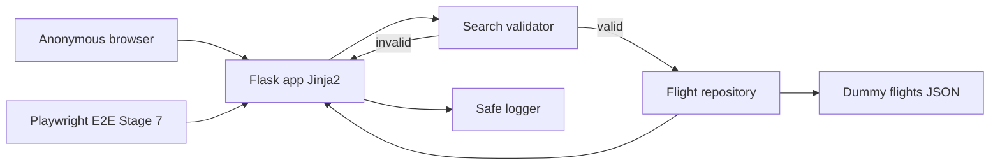
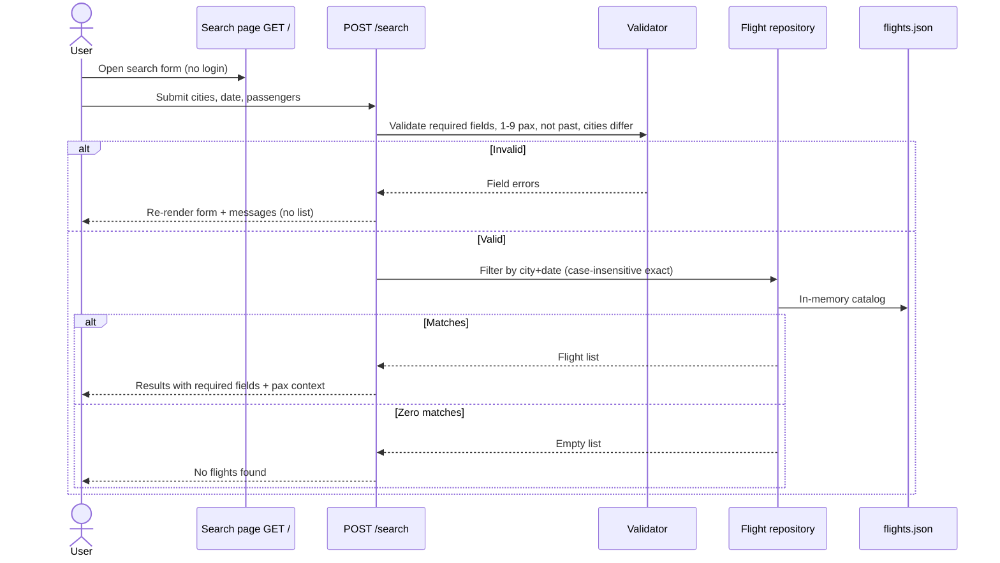

# Architecture

## Overview

KAN-1 (Search flight) is delivered as a small **Flask** Python web application. Anonymous users open a public search page, submit departure city, arrival city, travel date, and passenger count, and see either a dummy-flight result list, an empty-state message, or field-level validation errors. There is no booking, payment, authentication, or live airline integration.

The runtime is a single process: Flask serves Jinja2 HTML, a validator checks the form, and an in-memory repository filters a static JSON dummy catalog. Stage 7 Playwright E2E will drive this HTML UI (happy path, validation, no-results) against a locally running Flask server.

## Goals & Constraints (from requirements)

| Source | Constraint |
|--------|------------|
| FR-1–3 | Public, unauthenticated search page with required form fields and a **Search Flights** control |
| FR-4–5 | Query **dummy/mock** flights only; case-insensitive exact match on departure city, arrival city, and travel date |
| FR-6–8 | Reject same cities, past dates, missing/invalid fields, and passenger counts outside 1–9 **before** searching |
| FR-9–11 | Result rows show airline, flight number, cities, times, duration, stops, price; passengers are display-only; zero matches → “No flights found” |
| NFR | Python web app; Playwright E2E in Verify; no secrets in source/docs; graceful errors; search completes within 2s locally |
| Out of scope | Booking, real APIs, login, round-trip/multi-city, passenger-driven inventory, admin catalog UI |

Dummy-data storage (deferred from Stage 1): a versioned JSON file loaded at process start (see Components and Trade-offs).

## Component Diagram (mermaid)

Search sequence:

## Components & Responsibilities

| Component | Responsibility |
|-----------|----------------|
| Flask application (`app` factory) | HTTP server, URL routing, template rendering, CSRF-safe form POST, 404/500 handlers that never leak stack traces or secrets |
| Search page (Jinja2) | Labels, HTML date input (`YYYY-MM-DD`), passenger input, **Search Flights** button, error region, empty-state copy, result cards/table, passenger count as display context |
| Search validator | Required fields; passengers integer 1–9; trim + case-insensitive same-city reject; travel date not before server “today”; ISO date parse |
| Flight repository | Load dummy JSON at startup; case-insensitive exact match on departure city, arrival city, and `travel_date`; return list in stable display order |
| Dummy catalog (`data/flights.json`) | Static mock flights covering at least one matching date, one date with zero matches, mixed case city names, and all required display fields |
| Safe logger | Unexpected exceptions only (MVP); no tokens, no `api-conf.properties` contents |
| Playwright E2E (Stage 7, not implemented now) | Browser tests against the live Flask UI for AC flows |

**Requirement mapping:** FR-1–3 → Flask + search page; FR-4–5, FR-9–10 → repository + catalog + result/empty templates; FR-6–8 → validator; FR-11 → template context only; NFR verification → Playwright against GET `/` and POST `/search`; NFR security → gitignore + no secrets in catalog.

## Data Flow

1. **GET `/`:** Render empty search form. No catalog query.
2. **POST `/search`:** Read form fields (`departure_city`, `arrival_city`, `travel_date`, `passengers`).
3. **Validate** in order: presence → passenger range → parse date → not past (`date < today` rejected; **today is allowed**) → cities not equal after trim/casefold.
4. **On validation failure:** Re-render the form with submitted values (where safe) and user-visible messages. Do not call the repository. Do not show a result list.
5. **On validation success:** Repository filters in-memory flights where `departure_city.casefold() == input`, `arrival_city.casefold() == input`, and `travel_date == YYYY-MM-DD`. Passenger count is **not** used as a filter or price multiplier.
6. **Render:** If `len(results) > 0`, list each flight’s required fields and show passenger count as context. If zero, show “No flights found” (or equivalent). Target response well under 2 seconds (in-memory filter).

Catalog record shape (logical; implementation in Stage 5):

- `airline`, `flight_number`, `departure_city`, `arrival_city`, `travel_date`, `departure_time`, `arrival_time`, `duration`, `stops`, `price` (display string or number formatted in the template)

## Technology Choices (with rationale)

| Choice | Decision | Rationale |
|--------|----------|-----------|
| Language | Python 3 | Required by NFR and SDLC defaults |
| Web framework | **Flask** | Smallest fit for one public HTML form + results. Jinja2 is built-in, Playwright can target real DOM. No REST-only client is required. |
| Not FastAPI | — | FastAPI shines for JSON APIs. This story is server-rendered HTML; FastAPI would still need Jinja2 (or a SPA) with more ceremony and no MVP benefit. |
| Not Django | — | Django’s ORM, admin, and auth are unused: no login, no admin catalog, no booking models. Extra surface area without matching requirements. |
| Templates | Jinja2 (autoescape on) | Simple SSR; XSS-safe by default for dummy text fields |
| Dummy storage | JSON file → memory at startup | Human-readable fixtures for Playwright; no database or ORM for static mock data |
| Persistence | None | Search is stateless; no user sessions required beyond optional Flask secret for CSRF if forms use Flask-WTF |
| Tests (later) | pytest unit/integration + Playwright MCP E2E | Matches Stage 7 skill; unit-test validator + repository without a browser |
| HTTP | Flask development server locally; production WSGI deferred | MVP is local/dev search within 2s |

**Flask vs FastAPI vs Django (summary):** Choose **Flask** because KAN-1 is a single anonymous HTML search page against static JSON. Django is heavier than the out-of-scope admin/auth needs. FastAPI is API-centric and would add template wiring without improving the Playwright-facing UI.

## Interfaces / Contracts

### HTTP

| Method | Path | Auth | Behavior |
|--------|------|------|----------|
| GET | `/` | None | Search form; no results list |
| POST | `/search` | None | `application/x-www-form-urlencoded`: `departure_city`, `arrival_city`, `travel_date` (`YYYY-MM-DD`), `passengers`. 200 HTML: errors, results, or empty state (not a 4xx for business validation) |
| GET | `/health` | None | Optional liveness for local/E2E startup checks (`{"status":"ok"}`) |

Stable **element contracts** for Playwright (Stage 7 must use these `data-testid` values):

| `data-testid` | Element |
|---------------|---------|
| `search-form` | Form |
| `departure-city` | Departure input |
| `arrival-city` | Arrival input |
| `travel-date` | Date input |
| `passengers` | Passenger input |
| `search-submit` | Search Flights control |
| `validation-errors` | Validation message region (hidden/empty when valid) |
| `results-list` | Results container (absent or empty when invalid or zero matches) |
| `flight-card` | Each result row/card |
| `no-flights` | Empty-state message when valid search has zero matches |
| `passenger-context` | Display of submitted passenger count on success |

Result card inner test ids (or text within `flight-card`): `airline`, `flight-number`, `departure-city`, `arrival-city`, `departure-time`, `arrival-time`, `duration`, `stops`, `price`.

### Repository contract

`search(departure_city: str, arrival_city: str, travel_date: date) -> list[Flight]` — case-insensitive exact city match; exact date; never mutates catalog.

### Playwright E2E plan (Stage 7)

Scripts (paths reserved; **not authored in Stage 2**): `tests/e2e/test_search_happy.py`, `tests/e2e/test_search_validation.py`, `tests/e2e/test_search_no_results.py`.

Coverage: open `/` without login; submit matching dummy row (including `delhi` vs `Delhi`); same city error and no list; past date error; missing/out-of-range passengers; seeded date/city pair with zero matches → `no-flights`. Catalog must include fixtures that make these cases deterministic.

## Security & Secret Handling

- No API keys, airline credentials, or user accounts. Dummy JSON contains only public mock schedule/price display data.
- **Never commit** `api-conf.properties`, `.env`, or GitHub/Jira tokens. Keep `.gitignore` as in Stage 1.
- Jinja2 autoescape on; do not mark user cities as `|safe`.
- Do not log request bodies that could later include secrets; do not print `api-conf.properties`.
- Optional Flask `SECRET_KEY` for CSRF: environment variable only, never hardcoded; document a local-only default in `.env.example` if Flask-WTF is used.
- Anonymous access is intentional; no session identity.
- Unexpected 500s: generic user message + safe server log (exception type/message without secrets).

## Failure Modes & Resilience

| Failure | User-visible behavior | System behavior |
|---------|----------------------|-----------------|
| Missing/invalid form fields | Field/validation messages; no result list | No repository call |
| Same city / past date / passengers out of 1–9 | Clear validation error; no result list | No repository call |
| Valid search, zero rows | “No flights found” | 200 HTML; empty `results-list` |
| Dummy JSON missing or malformed at startup | App fails fast at boot (or `/health` unhealthy); no silent empty catalog that looks like “no flights” for every query | Log path/reason; do not invent flights |
| Unexpected exception during search | Generic error page/banner | Safe log; no stack trace in HTML |
| Concurrent local users | Stateless request handling; in-memory catalog is read-only | Acceptable for MVP |

Past-date comparison uses the Flask process local date as “today” (requirements: server/local today).

## Open Trade-offs

| Topic | Decision now | Alternative | Notes |
|-------|--------------|-------------|-------|
| Flask vs FastAPI vs Django | **Flask** | FastAPI+Jinja or Django | Revisit only if humans require an API-first or admin UI |
| JSON file vs SQLite | JSON in memory | SQLite | JSON is enough for static mocks; SQLite adds ops without AC benefit |
| Same-page POST vs GET query string | **POST `/search`** | GET with query params | POST avoids bookmarking personal search data; Playwright can still POST the form. Shareable URLs are not a requirement |
| CSRF (Flask-WTF) | Prefer on for POST forms | Bare POST | Slight extra config (`SECRET_KEY` from env); Playwright must include the token from the GET page |
| Result URL | 200 on POST | 303 to GET | POST-render is simpler for MVP; refresh re-POSTs (acceptable) |
| Price type | Display as provided in JSON | Currency localization | Out of scope beyond showing the dummy price |
| Health endpoint | Recommended | Skip | Helps Playwright wait-for-ready |

No production implementation code is included in this stage. Design Review (Stage 3) must not start until a human approves this architecture.
